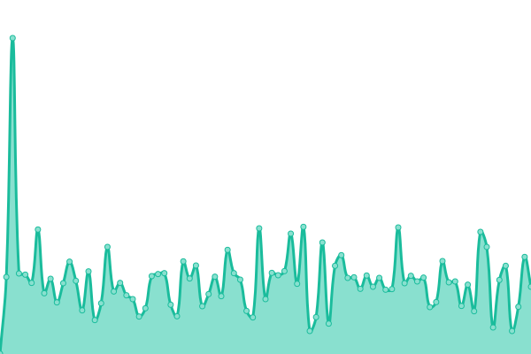
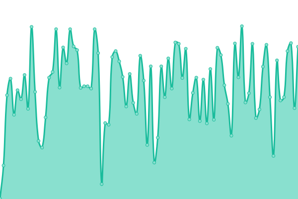
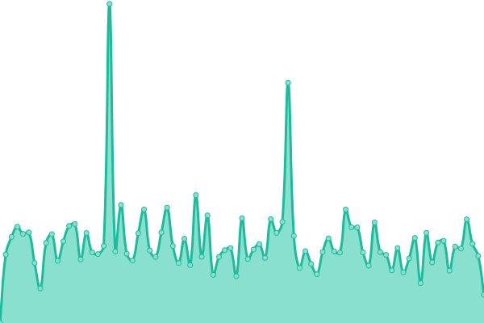

# [📈 Live Status](https://status.alchemyunbound.net): <!--live status--> **🟨 Degraded performance**

This repository contains the open-source uptime monitor and status page for [klutzybubbles](https://status.alchemyunbound.net), powered by [Upptime](https://github.com/upptime/upptime).

With [Upptime](https://upptime.js.org), you can get your own unlimited and free uptime monitor and status page, powered entirely by a GitHub repository. We use [Issues](https://github.com/klutzybubbles/alchemy-unbound-status/issues) as incident reports, [Actions](https://github.com/klutzybubbles/alchemy-unbound-status/actions) as uptime monitors, and [Pages](https://status.alchemyunbound.net) for the status page.

<!--start: status pages-->
<!-- This summary is generated by Upptime (https://github.com/upptime/upptime) -->
<!-- Do not edit this manually, your changes will be overwritten -->
<!-- prettier-ignore -->
| URL | Status | History | Response Time | Uptime |
| --- | ------ | ------- | ------------- | ------ |
|  Alchemy Unbound API | 🟨 Degraded | [alchemy-unbound-api.yml](https://github.com/KlutzyBubbles/alchemy-unbound-status/commits/HEAD/history/alchemy-unbound-api.yml) | 

 264ms
     
 | 

<a href="https://status.alchemyunbound.net/history/alchemy-unbound-api">0.00%</a>
    

|  Steam API | 🟩 Up | [steam-api.yml](https://github.com/KlutzyBubbles/alchemy-unbound-status/commits/HEAD/history/steam-api.yml) | 

 280ms
     
 | 

<a href="https://status.alchemyunbound.net/history/steam-api">100.00%</a>
    

|  OpenAI API | 🟩 Up | [open-ai-api.yml](https://github.com/KlutzyBubbles/alchemy-unbound-status/commits/HEAD/history/open-ai-api.yml) | 

 470ms
     
 | 

<a href="https://status.alchemyunbound.net/history/open-ai-api">100.00%</a>
    

<!--end: status pages-->

[**Visit our status website →**](https://status.alchemyunbound.net)

## 📄 License

- Powered by: [Upptime](https://github.com/upptime/upptime)
- Code: [MIT](./LICENSE) © [Anand Chowdhary](https://anandchowdhary.com), supported by [Pabio](https://pabio.com)
- Data in the `./history` directory: [Open Database License](https://opendatacommons.org/licenses/odbl/1-0/)
